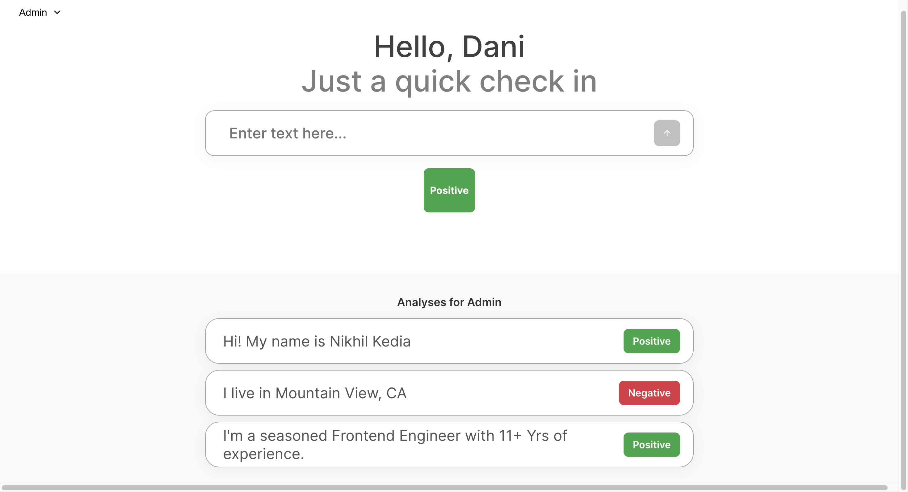

# Text Sentiment Analyzer

This project is a React-based application that allows users to analyze text sentiment (positive, neutral, or negative) through a simple user interface. The application includes a backend server that simulates text analysis and saves user-specific analysis results.

## Table of Contents

- [Text Sentiment Analyzer](#text-sentiment-analyzer)
  - [Table of Contents](#table-of-contents)
  - [Demo](#demo)
  - [Features](#features)
  - [Installation](#installation)
    - [Prerequisites](#prerequisites)
    - [Steps](#steps)
  - [Usage](#usage)
  - [Project Structure](#project-structure)
  - [Technology Stack](#technology-stack)
  - [API Endpoints](#api-endpoints)
  - [Future Improvements](#future-improvements)
  - [License](#license)

## Demo



## Features

- **User-Specific Analysis**: Users can select different user profiles, and each user's analysis history is stored and displayed.
- **Text Sentiment Analysis**: Provides real-time sentiment analysis using a simulated API.
- **Responsive UI**: The application is fully responsive, optimized for both desktop and mobile devices.
- **Recent Analyses**: Displays the last three analyses performed by the current user.

## Installation

### Prerequisites

- Node.js and npm/yarn installed on your machine.

### Steps

1. Clone the repository:

   ```bash
   git clone https://github.com/yourusername/text-sentiment-analyzer.git
   cd text-sentiment-analyzer
   ```

2. Install dependencies for both frontend and backend:

   ```bash
   # Install frontend dependencies
   npm install

   # Move to the server directory
   cd server

   # Install backend dependencies
   npm install
   ```

3. Start the development servers:

   ```bash
   # Start the backend server
   npm run server

   # In a separate terminal, start the frontend development server
   npm start
   ```

   The frontend will be running at `http://localhost:3000` and the backend at `http://localhost:3002`.

## Usage

1. Navigate to `http://localhost:3000` in your web browser.
2. Select a user from the dropdown.
3. Enter text in the input field to analyze its sentiment.
4. View the analysis result and the history of recent analyses.

## Project Structure

```
text-sentiment-analyzer/
│
├── public/                     # Static assets
├── src/                        # Frontend source files
│   ├── components/             # Reusable components
│   │   ├── Header/             # Header component
│   │   ├── InputField/         # Input field component
│   │   ├── ResultDisplay/      # Displays the analysis result
│   │   ├── UserAnalyses/       # Displays user-specific analysis history
│   │   └── UserDropdown/       # User selection dropdown
│   ├── hooks/                  # Custom hooks
│   │   └── useTextAnalyzer.js  # Custom hook for managing text analysis state
│   ├── App.js                  # Main application component
│   ├── App.module.css          # Global styles
│   └── index.js                # Application entry point
│
├── server/                     # Backend server files
│   ├── server.js               # Express server handling API requests
│   └── analysisData.json       # File where analysis data is stored
│
├── README.md                   # Project documentation
├── package.json                # Project metadata and dependencies
└── ...                         # Other configuration files
```

## Technology Stack

- **Frontend**: React, JavaScript, CSS Modules, React Suspense, React Lazy
- **Backend**: Node.js, Express.js
- **Icons**: Feather Icons
- **Version Control**: Git

## API Endpoints

- **`POST /api/analyze`**
  - Description: Analyzes the text and returns a sentiment (positive, neutral, or negative).
  - Request Body: `{ "text": "Your text here" }`
  - Response: `{ "result": "positive" }`

- **`POST /api/save-analysis`**
  - Description: Saves the analysis result for the current user.
  - Request Body: `{ "user": "User1", "text": "Your text here", "result": "positive" }`
  - Response: `{ "success": true }`

## Future Improvements

- **Database Integration**: Replace the JSON file with a proper database for persistent data storage.
- **User Authentication**: Implement user authentication to ensure each user's data is private.
- **Real Sentiment Analysis**: Integrate with a real sentiment analysis API.
- **UI Enhancements**: Improve the UI for better user experience, especially on mobile devices.

## License

This project is licensed under the MIT License. See the [LICENSE](LICENSE) file for more details.